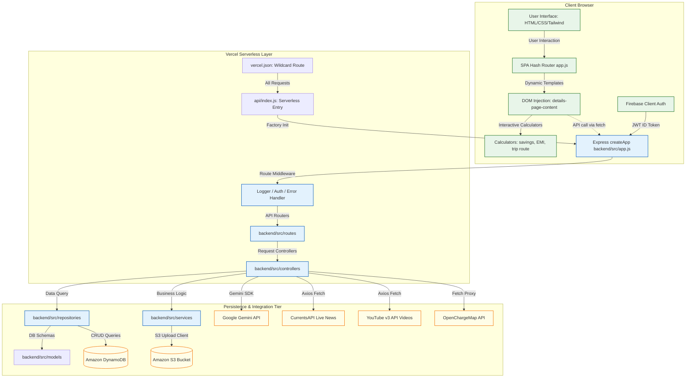

# EVcarwale System Architecture

EVcarwale is architected as a hybrid application combining a lightweight, zero-build, serverless **client-side Single Page Application (SPA)** with a Node.js + Express **API backend**. The entire application is packaged for deployment on Vercel, routing both static asset serving and REST API queries through a unified serverless Node.js handler.

---

## Architectural Block Diagram

---

## Architecture Layer Breakdown

### 1. Client-Side Presentation Layer
- **`index.html` (Entry Host)**: Serves as the landing page canvas and hooks global layout overlays (modals for booking, search, and video playback). Imports Google Web Fonts, Tailwind CSS CDN, jsPDF CDN, and the Firebase Web SDK.
- **`style.css` (Grayscale Design System)**: Restricts all UI highlight colors to grays, pure white, and charcoal `#111111`. Implements custom track scrollbars, skeleton loading shimmers, card hover lifts, and transition triggers.
- **`app.js` (Core SPA Driver)**: Houses client-side databases (specs, tax rules, distances, guide chapters) and handles the Single Page App routing loop, template layout compilation, calculator math, and browser PDF generators.

### 2. API Gateway & Serverless Layer
- **`vercel.json` (Deploy Configuration)**: Standardizes routing. Redirects all wildcard traffic (`/(.*)`) to the serverless function `api/index.js`.
- **`api/index.js` (Serverless Router)**: Loads environment variables, configures core AWS data services, and invokes `createApp` from the backend workspace to return the Express listener.

### 3. Backend Execution Layer
- **`backend/src/app.js` (Express App Factory)**: Manages core Express settings: CORS permissions, JSON payload limiters, logger bindings, and routes static assets from the workspace root or the public folder. It mounts `/api` routes and maps unmatched frontend path prefixes to `index.html`.
- **`backend/src/routes/` (REST Routers)**: Maps request endpoints (e.g. `/api/cars`, `/api/news`) to their respective controller handlers, applying auth verification middleware where required.
- **`backend/src/middleware/` (Express Middlewares)**:
  - `auth.js`: decodes incoming Firebase authentication headers.
  - `errorHandler.js`: catches application exceptions, normalizing errors to JSON replies.
  - `requestLogger.js`: logs API request parameters.

### 4. Repository & Database Layer
- **`backend/src/controllers/` (Request Handlers)**: Validates request payloads and routes execution calls to services or repositories.
- **`backend/src/services/` (Services)**: Standardizes business processes (user updates, S3 media uploads).
- **`backend/src/repositories/` (Repositories)**: Performs DynamoDB operations. Inherits CRUD capabilities from the shared repository driver `dynamoRepository.js`.
- **`backend/src/models/` (Data Schemas)**: Houses key-value definitions (partition keys, sort keys, database columns) representing entity structures.

---

## Key Architectural Decisions

### 1. Unified Single-Table Modeling
The backend utilizes DynamoDB to manage multiple entities (Users, Favourites, Recently Viewed, Reviews, Test Drive Leads, Newsletter Subscriptions, Chat History) in a single-table layout pattern or clean prefix-divided indices. By structuring keys dynamically using `pk` and `sk` (e.g., `USER#<uid>` and `FAVOURITE#<carId>`), the database minimizes indexing overhead and supports decoupled repository queries.

### 2. Serverless Execution with Express Routing
Rather than building standalone serverless endpoints for each API path, the project runs an entire Express application behind a single serverless Vercel function (`api/index.js`). This approach simplifies routing, enables standard Express middleware usage, and supports both local development (`node server.js`) and cloud hosting without codebase alterations.

### 3. Graceful Database Fallbacks
If AWS or DynamoDB parameters are not configured, read operations default to empty arrays or local files (`Cars.json`), and write operations return a descriptive `503 Service Unavailable` error instead of throwing uncaught exceptions. This allows the frontend to run as a client-side mockup while preparing database keys.

### 4. Modular Third-Party API Proxies
The backend acts as an API proxy for third-party endpoints:
- **YouTube API & CurrentsAPI**: Integrates caching mechanisms to avoid hitting rate limits and handles relevance-filtering.
- **OpenChargeMap API**: Proxies POI requests to hide developer API keys from client-side network inspectors.
- **Google Gemini API**: Implements system prompts and error boundaries, exposing a simple `/api/chat` endpoint to the frontend.
