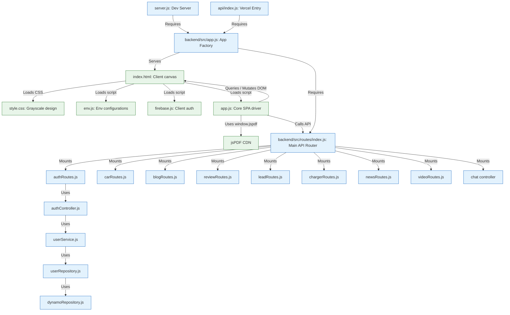

# EVcarwale Codebase Dependency Graph

This document details the modular relationships, script linkages, and selector dependencies across both frontend and backend directories.

---

## 1. Codebase Dependency Diagram

---

## 2. Structural Dependencies

### A. HTML to JS DOM Selectors
The frontend driver (`app.js`) is heavily coupled with selector IDs and CSS classes inside `index.html`. Removing or renaming these elements will break frontend execution:

| Selector Key (ID / Class) | Type | Responsible JS Subsystem | Result of Modification / Removal |
| :--- | :--- | :--- | :--- |
| `#homepage-content` | Div | `restoreHomepage()`, `handleRouting()` | The main homepage dashboard fails to show/hide. |
| `#details-page-content` | Div | `renderCarDetailsPage()`, `handleRouting()` | Car details template injection breaks, halting subpage renders. |
| `#preloader` / `#loader-progress` | Div | `runPreloader()` | Startup loader screen hangs. |
| `#slider-price` / `#slider-down` | Slider | `updateEMICalculator()` | Loan EMI amortization calculations fail. |
| `#savings-select-ev` | Select | `updateLandingSavings()` | Fuel savings engine fails to load EV efficiency indices. |
| `.jargon-term` | Class | `applyJargonBuster()` | Custom tooltip bindings for EV terminology fail. |
| `.variant-tab-btn` | Class | `renderCarDetailsPage()` | In-page variant trim calculations break. |

### B. Backend Configurations & Environment Keys
The Express server depends on configuration models in `backend/src/config/`:
- **`env.js`**: Validates keys and exposes options to the server runtime.
- **`aws.js`**: Initializes DynamoDB and S3 clients.
- **`firebaseAdmin.js`**: Reads service keys to configure Google token verification.

---

## 3. High Impact Files (Modify with Caution)

1. **[app.js](file:///Users/tanisha/Documents/EVcarwale/app.js) (Critical Client Impact)**:
   Contains all static catalogs, range math formulas, RWA letter specifications, SPA routing paths, and event registrations. Single-character syntax issues will break the entire client experience.
2. **[backend/src/app.js](file:///Users/tanisha/Documents/EVcarwale/backend/src/app.js) (Critical Backend Impact)**:
   Initializes CORS, body parsing limits, and routing mount pathways. Changes here can break REST communications.
3. **[index.html](file:///Users/tanisha/Documents/EVcarwale/index.html) (High Client Impact)**:
   Defines the markup containers (homepage, detail page, modal windows). Modifying structural layouts will break element bindings in `app.js`.
4. **[backend/src/repositories/dynamoRepository.js](file:///Users/tanisha/Documents/EVcarwale/backend/src/repositories/dynamoRepository.js) (High Database Impact)**:
   Standardizes CRUD execution paths for DynamoDB. A bug introduced here will cascade to all data endpoints, blocking profile syncs, test drive lead bookings, and reviews.
