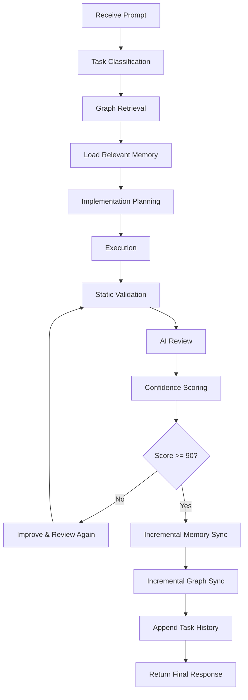

# Runtime Execution Lifecycle

Defines the execution phases for prompt processing.

## Lifecycle Execution Rules
1. **No Phase Skipping**: All stages must be executed in order.
2. **Deterministic Backoff**: If static validation fails, return directly to coding. Skip AI review.
3. **Synchronization**: Incremental memory updates must occur only after accepted tasks.
